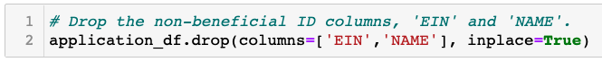
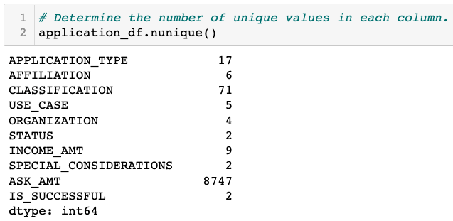
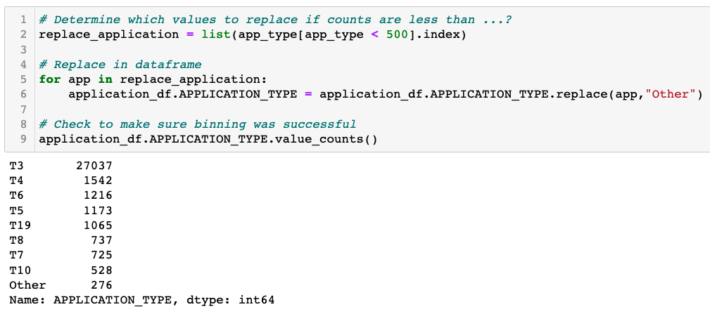
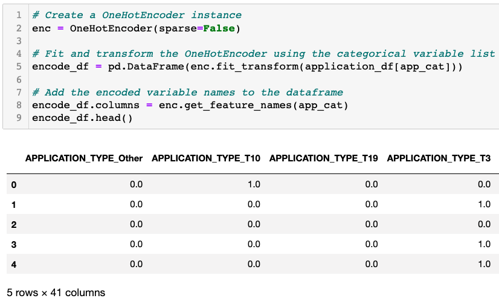
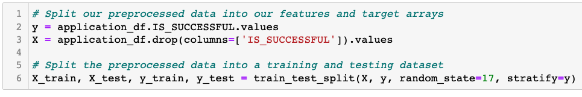
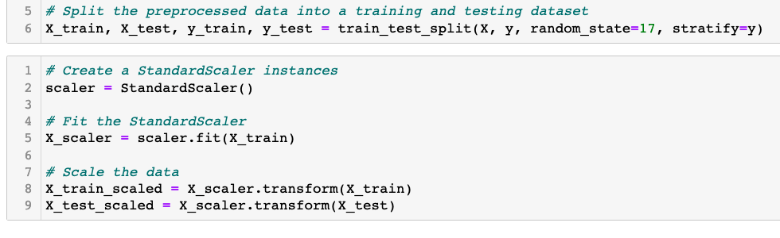
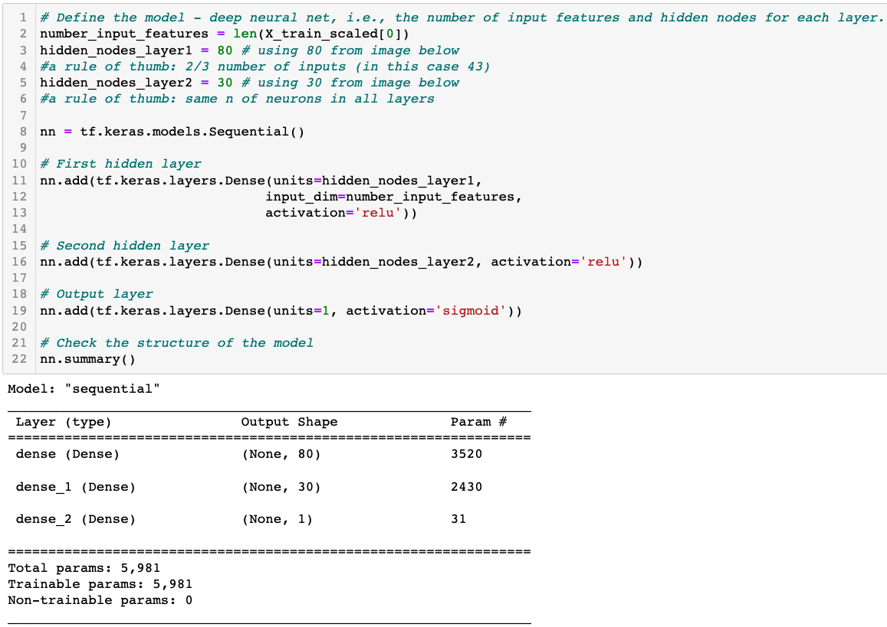
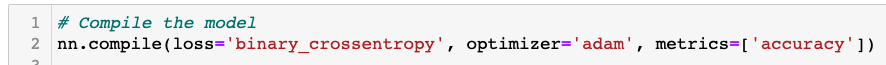
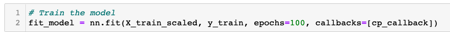
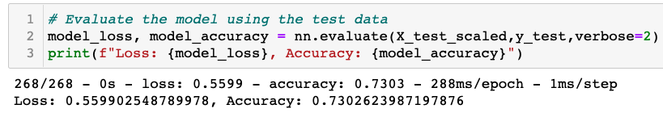

# Neural_Network_Charity_Analysis
BC Mod 19

## Overview
Alphabet Soup, a non-profit organization focusing on environmental protection,
regularly funds the activities of other similarly-minded organizations. Alphabet
Soup has compiled a rich dataset of previous applications for funding and the
results of the funding.

The purpose of this analysis is to determine the characteristics of successful
funding ventures by Alphabet Soup. Using a neural network binary classifier to
determine whether current applications will be successful, Alphabet Soup can
allocate its funds to other organizations with the greatest chance for success.

### Resources
* Jupyter Notebook 6.4.6
* Python 3.7.11

Python Dependencies:
* pandas
* tensorflow
* matplotlib
* os
* ModelCheckpoint from tensorflow.keras.callbacks
* train_test_split from sklearn.model_selection 
* StandardScaler and OneHotEncoder from sklearn.preprocessing

## Results
The data was preprocessed, which included dropping unneeded columns, binning the
results of various columns to reduce the number of unique values, and changing
various columns from one column with several unique values to a series of
columns with true/false value options. This last process is done for the sake of
the machine learning model's data requirements.

* Drop unneeded columns as they are neither targets nor features:   
  

* Of the remaining columns, each had the following number of unique values:  
  

* Since there were 17 types of applications, the number of each type is  displayed here:  
  

* The application types with fewer than 500 instances were binned together as  'other':  
  

* The same process was followed for the Classification variable.  

* All columns now were turned into binary variable types through SciKit's OneHotEncoder process. The columns were then merge into the primary dataframe.  
  

* At this point, the target (IS_SUCCESSFUL) is separated from the features (remaining columns):  
  

* Additionally, the dataset is split for training and testing the model:  
  

### Data Preprocessing
* The neural network binary classifier was trained with two hidden layers of 80 and 30 neurons respectively, using 'relu' activation. The output layer used 'sigmoid' activation.  
  

* The model was compiled:  
  

* and trained:  
  

* which resulted in an accuracy of 73%:  
  

### Compiling, Training, and Evaluating the Model
Lorem ipsum

## Summary
Lorem ipsum
