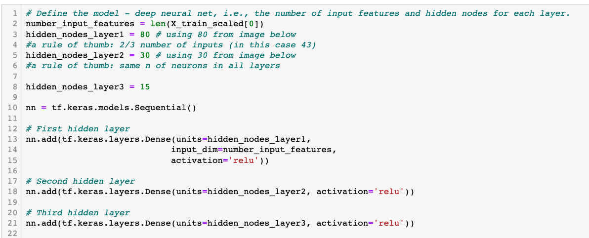
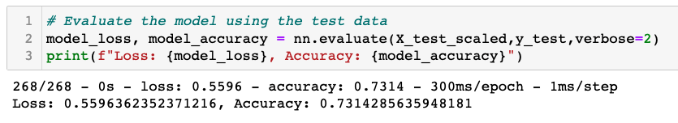
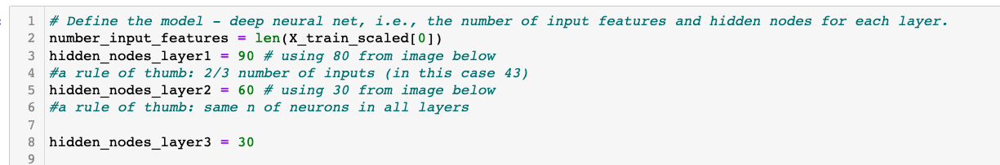
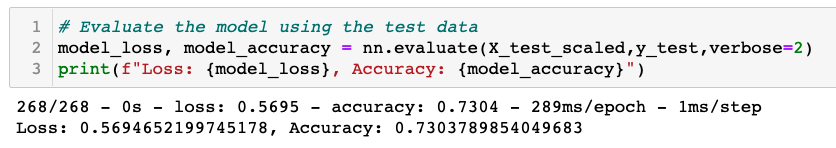
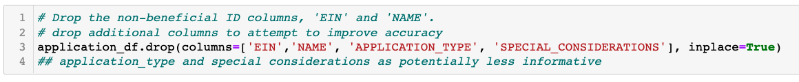
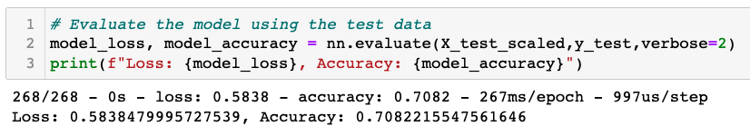
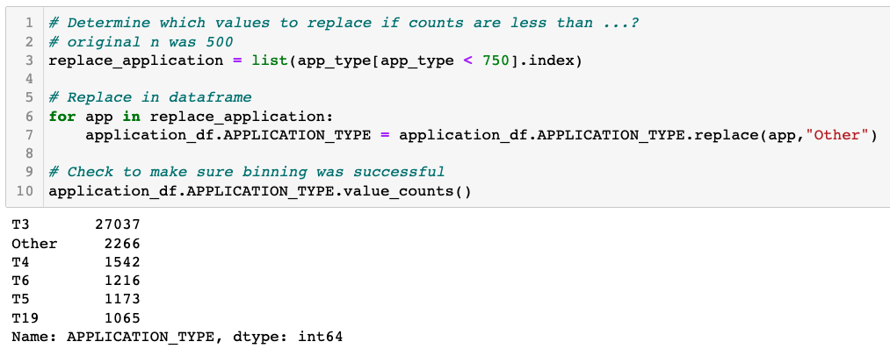
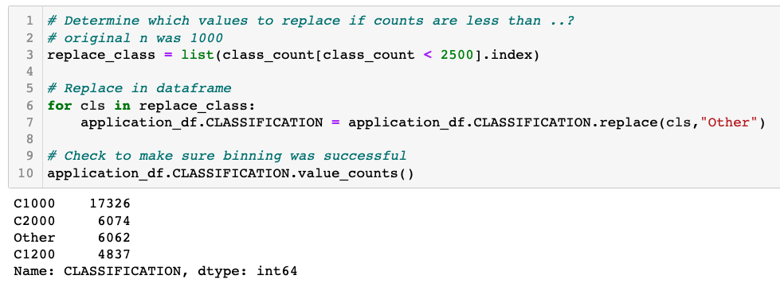
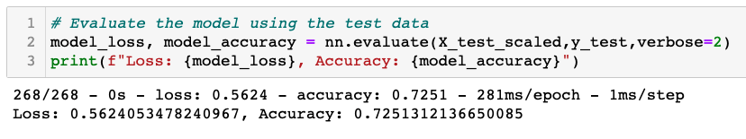

# Neural_Network_Charity_Analysis
BC Mod 19

## Overview
Alphabet Soup, a non-profit organization focusing on environmental protection,
regularly funds the activities of other similarly-minded organizations. Alphabet
Soup has compiled a rich dataset of previous applications for funding and the
results of the funding.

The purpose of this analysis is to determine the characteristics of successful
funding ventures by Alphabet Soup. Using a neural network binary classifier to
determine whether current applications will be successful, Alphabet Soup can
allocate its funds to other organizations with the greatest chance for success.

### Resources
* Jupyter Notebook 6.4.6
* Python 3.7.11

Python Dependencies:
* pandas
* tensorflow
* matplotlib
* os
* ModelCheckpoint from tensorflow.keras.callbacks
* train_test_split from sklearn.model_selection 
* StandardScaler and OneHotEncoder from sklearn.preprocessing

## Results
The data was preprocessed, which included dropping unneeded columns, binning the
results of various columns to reduce the number of unique values, and changing
various columns from one column with several unique values to a series of
columns with true/false value options. This last process is done for the sake of
the machine learning model's data requirements.

### Data Preprocessing
* Drop unneeded columns as they are neither targets nor features:   
  

* Of the remaining columns, each had the following number of unique values:  
  

* Since there were 17 types of applications, the number of each type is  displayed here:  
  

* The application types with fewer than 500 instances were binned together as  'other':  
  

* The same process was followed for the Classification variable.  

* All columns now were turned into binary variable types through SciKit's OneHotEncoder process. The columns were then merge into the primary dataframe.  
  

* At this point, the target (IS_SUCCESSFUL) is separated from the features (remaining columns):  
  

* Additionally, the dataset is split for training and testing the model:  
  

### Compiling, Training, and Evaluating the Model
* The neural network binary classifier was trained with two hidden layers of 80 and 30 neurons respectively, using 'relu' activation. The output layer used 'sigmoid' activation.  
  

* The model was compiled:  
  

* and trained:  
  

* which resulted in an accuracy of 73%:  
  

## Attempts to Improve Model Accuracy
The following three attempts were made to improve the model's accuracy above
73%.  

### Attempt 1  
* Add a hidden layer:   
  

* Attempt 1 results resulted in an insignificant improvement.  
  

### Attempt 1b  
* Since attempt 1 was marginally successful, neurons were added to each hidden layer.  
  

* The results of this attempt did not improve upon the original model or attempt 1.  
  

### Attempt 2  
* Returning to the original number of hidden layers and neurons, this attempt dropped additional columns as potentially unnecessary.  
  

* The results of attempt 2 were worse than the original and attempt 1 & 1b.  
  

### Attempt 3  
* Using the original model's baseline, this attempt changed the number of instances per value that were binned.  
  
  

* The results were marginally worse than the original model, achieving 72.5%
accuracy.  
  

## Summary
This neural network model achieved 73% accuracy with the initial configuration.
While admirable, a higher accruacy rate would be desirable. Three attempts were
made to improve the model using, in isolation, increasing the number of hidden
layers, increasing the neurons per layer, removing features from the model, and
changing the number of instances at which a value was binned. Only increasing
the number of hidden layers improved upon the original, though did not improve
the model significantly.  

There are several options for improving the model. One option would be to use
the techniques mentioned above but in combination. Perhaps this would increase
the accuracy above 75%, but that is yet to be determined. A second option would
be to increase the size of the training dataset. Additional data would likely
give the model more opportunity to learn and thereby increase the accuracy. A
third option would be to use a different binary classifier, such as the Random
Forest Classifier.
